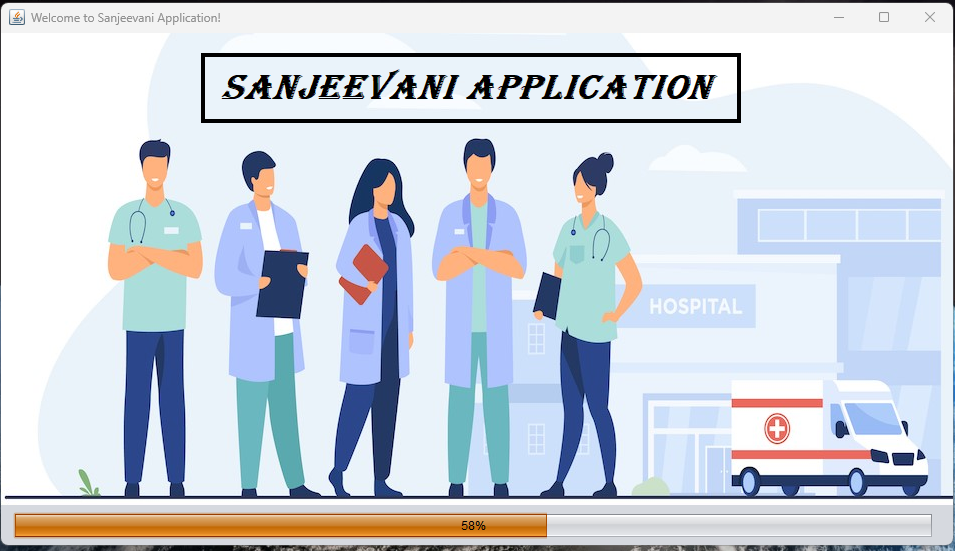
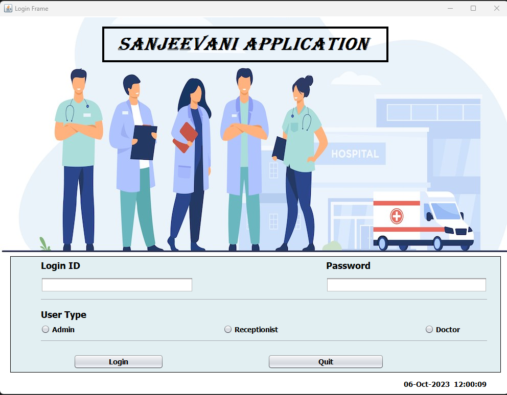
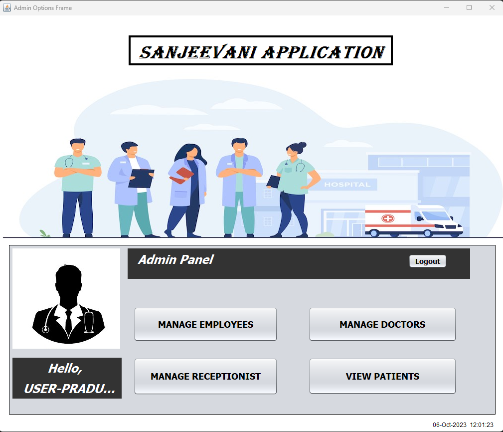
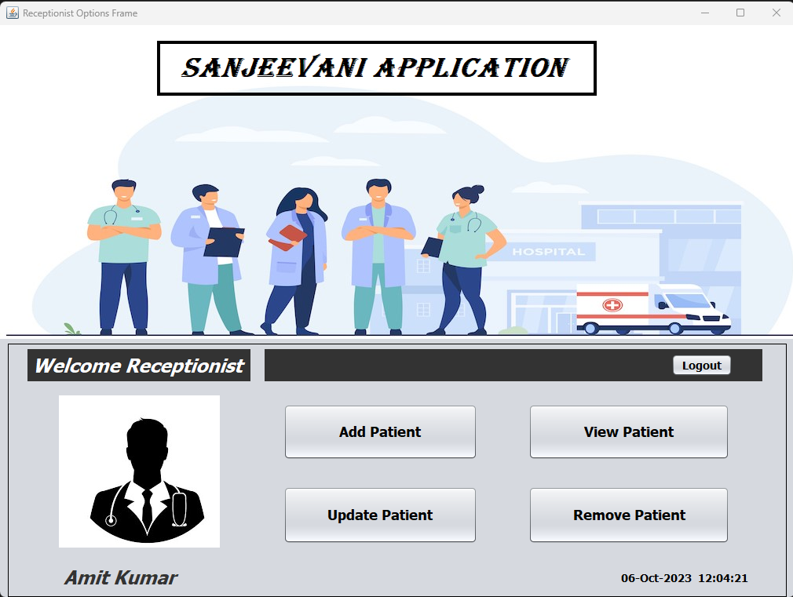
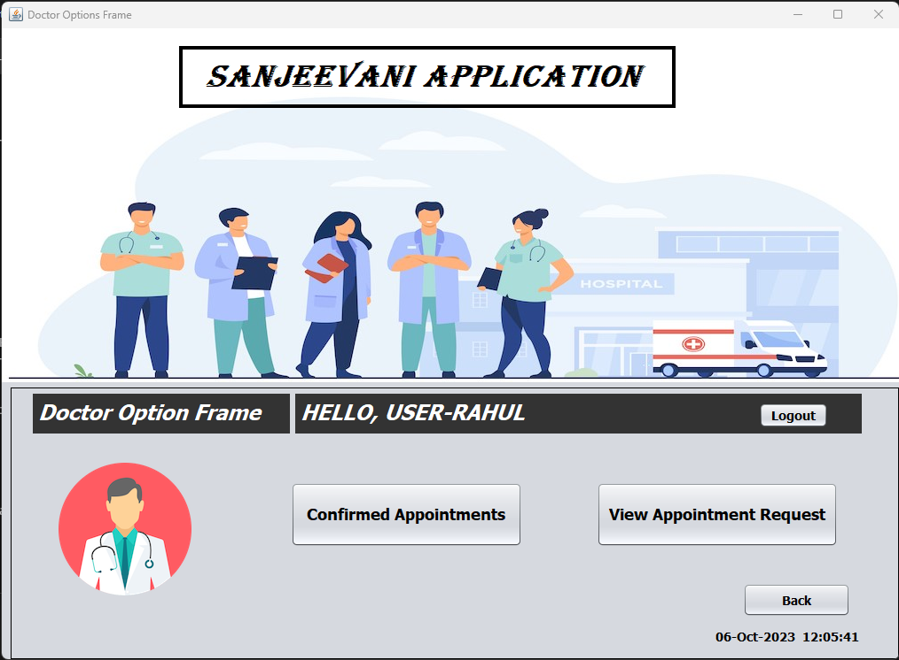

# Sanjeevani_Application
This is a Java based desktop application. The purpose of this application is to improve the hospital management services as it can provide basic facilities so that the receptionist can help the patients visiting at their hospital by checking availability of the doctors, making appointment with them, etc.
# Technologies Used
1. Swing
2. JDBC
3. SQL
4. Exception Handling
5. Multithreading
# Screenshots
1. Splash Screen

2. Login Screen

3. Admin Options

4. Receptionist Options

5. Doctor Options

